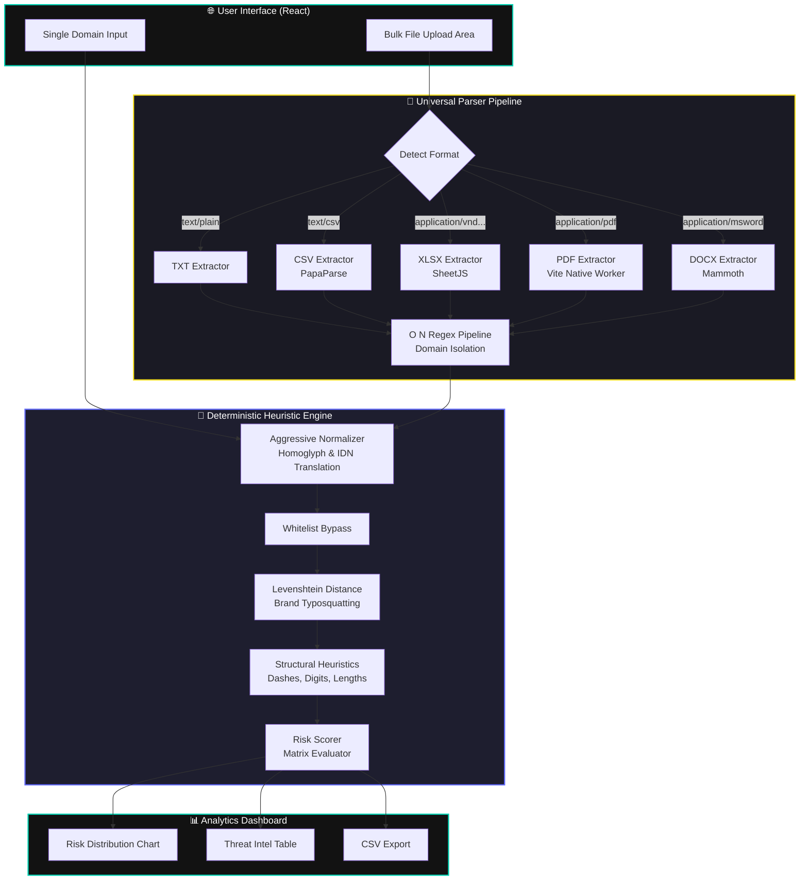

# 🛡️ PhishGuard

> **An Advanced Deterministic Phishing Domain Classifier & Bulk Analysis Engine**

[](https://vercel.com/new/clone?repository-url=https%3A%2F%2Fgithub.com%2Fankitpremi12%2Fphishguard-classifier)


**PhishGuard** is a lightning-fast, highly accurate web application built to detect zero-day phishing domains, typosquatting attacks, and homograph spoofing. 

Unlike traditional platforms that rely on slow, black-box Machine Learning models, PhishGuard runs a **multi-layered deterministic heuristic engine** natively in the browser. It features a "Universal Parser" that can rip raw domains from almost any document format, making it the perfect tool for bulk threat-intelligence analysis.

---

## ✨ Key Features
- **Deterministic Heuristic Engine:** 0ms latency, fully explainable risk scoring, and impossible to trick using adversarial ML prompts.
- **Universal Bulk Parser:** Drag and drop **PDFs, DOCX, XLSX, CSV, or TXT** files. The system automatically converts binary files to raw text, extracts raw URLs/domains using an $O(N)$ high-performance regex engine, and scans them instantly.
- **Cinematic UI/UX:** A robust, premium dark-mode interface featuring smooth URL-breakdown micro-animations, donut charts, and severity tables.
- **Privacy-First:** 100% of the extraction and classification runs entirely inside the client’s browser. No sensitive documents are ever uploaded to a server.

---

## 🏗️ System Architecture



---

## 🛠️ Technology Stack

### Frontend & Core
- **[React 19](https://react.dev/):** UI component orchestration.
- **[Vite](https://vitejs.dev/):** Lightning-fast HMR and optimized production bundling.
- **[Chart.js / React-Chartjs-2](https://react-chartjs-2.js.org/):** Data visualization for threat analytics.

### File Parsing Sub-System
*These libraries are lazily loaded (dynamically imported) using Vite to keep the initial page load under 100kb.*
- **[pdfjs-dist](https://mozilla.github.io/pdf.js/):** Natively bundled via a Vite `?worker` module to completely bypass strict browser cross-origin policy blocks. Extracts text data from binary PDFs.
- **[XLSX (SheetJS)](https://sheetjs.com/):** For multi-sheet Excel spreadsheet extraction.
- **[PapaParse](https://www.papaparse.com/):** High-speed CSV parsing.
- **[Mammoth](https://github.com/mwilliamson/mammoth.js/):** Converts `.docx` files to raw strings safely.

---

## 🧠 The Algorithm: Why Deterministic Heuristics?

Many modern cybersecurity startups push **Machine Learning (ML)** for everything. However, for Phishing Domain Detection, relying purely on ML introduces edge-case vulnerabilities, high server costs, and "black box" decisions.

**PhishGuard opts for a Deterministic Heuristic Pipeline.** 

### Why is this vastly superior for this use case?
1. **0ms Latency:** ML requires server roundtrips or heavy TF.js models loaded client-side. PhishGuard evaluates thousands of domains locally in milliseconds.
2. **Defends against Adversarial Manipulation:** Attackers can trick ML models by balancing "safe" features against malicious ones. A deterministic engine applies strict, unbypassable rules.
3. **100% Explainability:** ML outputs a probability (e.g., `87% malicious`). PhishGuard outputs ***why***: `"Score: 82. Reason: Exact Homoglyph match for 'amazon' (amaz0n), contains 3 structural flags."`

### ⚙️ How the Algorithm Works
1. **Aggressive Normalization:** Cybercriminals use homoglyphs (`0` for `o`, `1` for `l`, `rn` for `m`). The engine first strips subdomains, uncovers IDNs (Internationalized Domain Names), and flattens trick characters.
2. **Brand Typosquatting:** It utilizes the **Levenshtein Distance** algorithm. If a domain is `ax1sbank.com`, the engine measures the minimum number of single-character edits required to reach a protected brand like `axisbank`.
3. **Structural Heuristics:** It checks length thresholds, excessive hyphenation (e.g., `secure-login-hdfc-update.com`), digit-substitution ratios, and suspicious TLDs (`.xyz`, `.top`, `.ml`).
4. **Calculated Risk Matrix:** Every red flag contributes an assigned mathematical weight. If the total weight exceeds strict thresholds, the domain is flagged as `Suspicious`, `Malicious`, or `Critical`.

---

## 💻 Local Development

To run this project locally:

1. **Clone the repository:**
   ```bash
   git clone https://github.com/ankitpremi12/phishguard-classifier.git
   cd "phishguard-classifier/web"
   ```

2. **Install Dependencies:**
   ```bash
   npm install
   ```

3. **Start the Development Server:**
   ```bash
   npm run dev
   ```

4. **Build for Production:**
   ```bash
   npm run build
   ```

---
*Built with precision to make the internet safer.*
