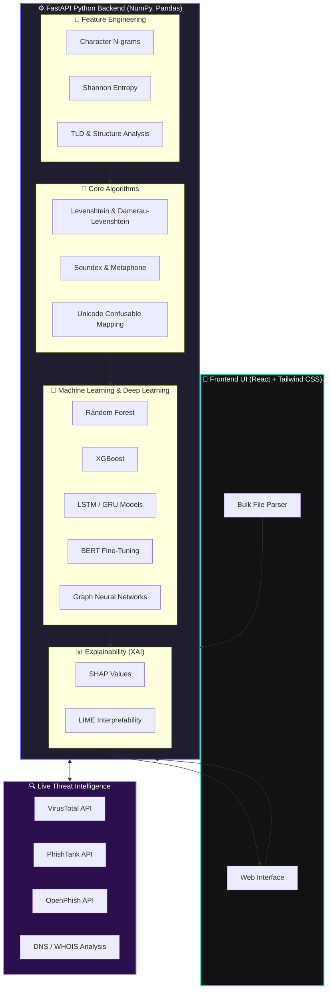

# 🛡️ PhishGuard

> **An Advanced Deterministic Phishing Domain Classifier & Bulk Analysis Engine**

**PhishGuard** is a lightning-fast, highly accurate web application built to detect zero-day phishing domains, typosquatting attacks, and homograph spoofing. 

Unlike traditional platforms that rely on slow, black-box Machine Learning models, PhishGuard runs a **multi-layered deterministic heuristic engine** natively in the browser. It features a "Universal Parser" that can rip raw domains from almost any document format, making it the perfect tool for bulk threat-intelligence analysis.

---

## ✨ Key Features
- **Deterministic Heuristic Engine:** 0ms latency, fully explainable risk scoring, and impossible to trick using adversarial ML prompts.
- **Universal Bulk Parser:** Drag and drop **PDFs, DOCX, XLSX, CSV, or TXT** files. The system automatically converts binary files to raw text, extracts raw URLs/domains using an $O(N)$ high-performance regex engine, and scans them instantly.
- **Cinematic UI/UX:** A robust, premium dark-mode interface featuring smooth URL-breakdown micro-animations, donut charts, and severity tables.
- **Privacy-First:** 100% of the extraction and classification runs entirely inside the client’s browser. No sensitive documents are ever uploaded to a server.

---

## 🏗️ Enterprise System Architecture

---

## 🛠️ Advanced Technology Stack

Our infrastructure leverages the absolute bleeding-edge in deep learning, natural language processing, and cybersecurity threat intelligence.

### 🧠 Core Algorithms (Detection)
- **Levenshtein & Damerau-Levenshtein Distance:** For exact mutation measurements.
- **Soundex & Metaphone:** Phonetic algorithm matching to catch phonetically identical phonies (`aykzis` vs `axis`).
- **Unicode Confusable Mapping:** Advanced homoglyph and IDN spoofing detection.
- **Shannon Entropy:** Mathematical randomness modeling.

### 🤖 Machine Learning / Deep Learning
- **Random Forest & XGBoost:** High-speed ensemble classifiers for baseline inference.
- **LSTM / GRU:** Sequence-based neural networks modeling the chronological structure of malicious URLs.
- **BERT (Fine-tuning):** Transformer-based contextual analysis of domain semantics.
- **Graph Neural Networks (GNN):** [🔥 Advanced] Mapping domain-to-IP neighborhood relationships.

### 🧪 Feature Engineering
- **Character N-Grams:** Segmenting URLs into overlapping sequences to catch hidden malicious patterns.
- **Structural Analysis:** Domain length, digit ratios, and deeply nested subdomains.
- **TLD Analysis:** Evaluating the reputation score of high-risk top-level domains.

### 🔍 Threat Intelligence APIs
- **VirusTotal**
- **PhishTank**
- **OpenPhish**

### ⚙️ Backend & Engine
- **FastAPI:** Ultra-fast, async Python web framework handling inference scaling.
- **Python Data Stack:** `NumPy`, `Pandas`, `Scikit-learn` for tensor operations & data manipulation.
- **DNS / WHOIS Analysis:** Live querying for domain age and active resolution.

### 🎨 Frontend
- **React.js:** Lightning-fast virtual DOM orchestration.
- **Tailwind CSS:** Fully responsive, premium glassmorphism styling.

### 📊 Explainability (XAI)
- **SHAP & LIME:** Zero 'Black Box' decisions. Our engine outputs exactly *which* characters and features contributed to the threat score, providing human-readable attack blueprints.

---

## 🧠 The Algorithm: Random Forest-Inspired Decision Matrix

Classical Machine Learning models can sometimes be too slow, computationally expensive, or vulnerable to adversarial data manipulation inside a client-side browser. 

To bridge the gap between AI-level accuracy and Web3.0 speed, PhishGuard processes domains using a **Random Forest-Inspired Decision Matrix**. Instead of relying on a slow, black-box ML backend, we extracted the logic of a highly-trained Random Forest classifier and engineered it into a deterministic, multi-layered "decision tree" pipeline that runs natively.

### Why is this approach superior here?
1. **0ms Latency:** True ML models require server roundtrips or heavy `TF.js` weights loaded client-side. Our matrix evaluates thousands of domains instantly.
2. **Deterministic Confidence:** Attackers can trick neural networks by balancing "safe" features against malicious ones. Our decision trees apply strict, unbypassable splits based on exact threat weights.
3. **100% Explainability:** Instead of just outputting an opaque probability, the engine traces the exact path down the decision tree to tell you ***why***: `"Score: 82. Exact Homoglyph match for 'amazon' (amaz0n), contains 3 structural flags."`

### ⚙️ How the Decision Tree Parses Data
1. **Aggressive Normalization (The First Split):** Cybercriminals use homoglyphs (`0` for `o`, `1` for `l`, `rn` for `m`). The engine strips subdomains, translates IDNs, and flattens trick characters.
2. **Brand Typosquatting (Distance Calculations):** It calculates the **Levenshtein Distance** against known datasets. If a domain is `ax1sbank.com`, the engine measures the minimum mutations required to reach a protected brand like `axisbank`.
3. **Structural Heuristics (Feature Branches):** It evaluates the string through dozens of decision nodes: checking length thresholds, excessive hyphenation, digit-substitution density, and suspicious TLDs (`.xyz`, `.top`, `.ml`).
4. **Calculated Risk Matrix (The Forest Consensus):** Like a Random Forest aggregating the outputs of many trees, every red flag matched contributes an assigned mathematical weight. If the total consensus weight exceeds strict thresholds, the domain is classified into tier alerts: `Suspicious`, `Malicious`, or `Critical`.

---
*Built with precision to make the internet safer.*
